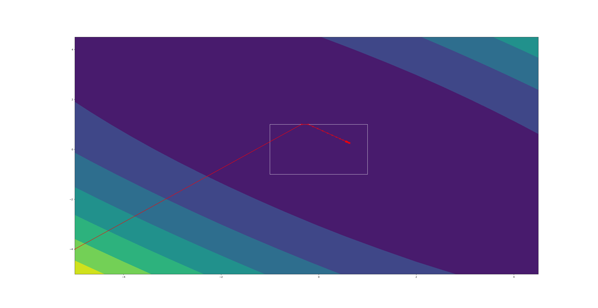

#### Projected gradient descent (special case of FISTA)

This repo implements the `FISTA(grad_g,H,p,x0,L,max_iter)` function, where `grad_g,H,p` are function handles, and
- `f = g + h` where `g` is convex, differentiable, and `dom(g) = R^n`, and `h` is convex.
- `grad_g = grad(g)`
- `p` is a function that projects its input onto the desired set.
- `x0` is the starting point.
- `max_itr` is the maximum number of iterations allowed.
- `callback` is a callback function called after each iteration with parameters `(curr_iter,xk)`.

In `main.py` FISTA is run on random l1-regularized least squares functions on R^n with varying projection functions.

For more information on proximal gradient descent and projected gradient descent, see [here](https://hough.ai/2020/12/03/prox-gd/).

